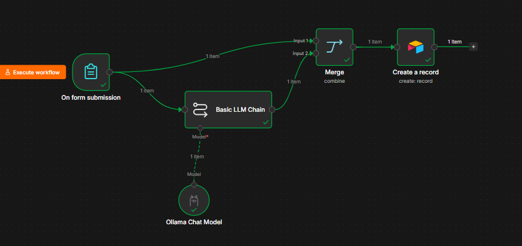
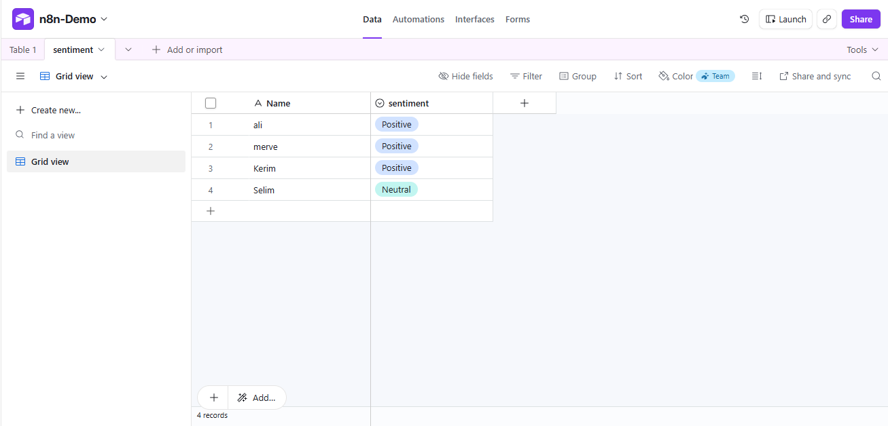

# Hotel Review Sentiment Analysis Automation

### Form Input

### Workflow

### Database Output (Airtable)

## Overview

This project is an AI-powered workflow built with n8n, Ollama, and Airtable. The workflow collects hotel reviews through a form, analyzes the sentiment using a local AI model, and automatically stores the results in Airtable.

## Workflow

1. User submits a hotel review through a form.
2. The review is sent to an AI model running locally with Ollama.
3. The AI analyzes the sentiment of the review.
4. The review data and sentiment result are merged.
5. The final data is automatically saved to Airtable.

## Technologies Used

* n8n
* Ollama
* Airtable
* AI Sentiment Analysis

## Features

* Automated form processing
* AI-powered sentiment analysis
* Positive, Negative, and Neutral classification
* Automatic data storage in Airtable
* No-code/low-code workflow automation

## Example

**Review:**
"The hotel was very clean and the staff were friendly."

**Sentiment:**
Positive

